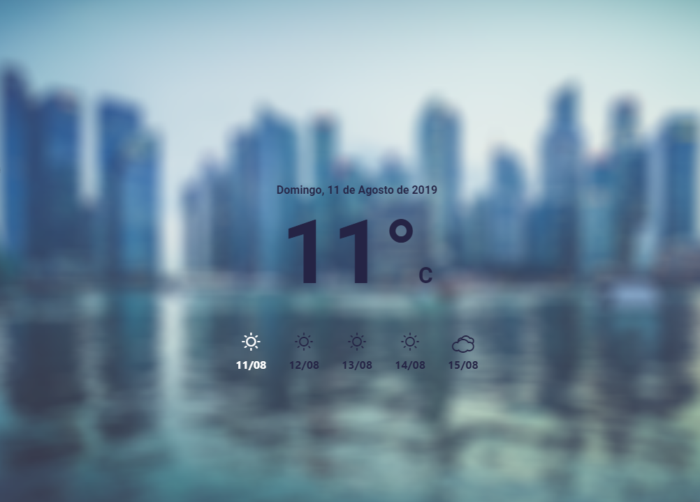

# Weather Forecast Wallpaper
Web project based on https://github.com/codrops/RainEffect.

<h2>Steps to configure the project:</h2>
<ol>
  <li>Install npm: https://docs.npmjs.com/getting-started/installing-node</li>
  <li>Install gulp: https://www.npmjs.com/package/gulp-install</li>
  <li>Go to project folder and run:
    <ul>
      <li><code>npm install</code>, to install dependencies</li>
      <li><code>gulp js</code>, to generate a single file with all the files of src folder. The file will be created inside <i>application/js/</i> folder, with the name <i>index.min.js</i></li>
    </ul>
  </li>
  <li>Add the generated file (<i>index.min.js</i>) into your html file.</li>
</ol>
Project configured!

<h2>Steps to run the project:</h2>
<ol>
  <li>Run <code>npm install -g live-server</code>, <q>This is a little development server with live reload capability.</q> (https://github.com/tapio/live-server)</li>
  <li>Go to <i>index.html</i> folder and run <code>live-server</code></li>
</ol>
Project running!

<h3>
There is an example with a project already configured inside <i>demo_application/</i> folder
</h3>

<h2>Screenshots:</h2>
